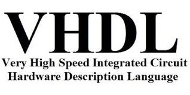

<!--
**tapyu/tapyu** is a ✨ _special_ ✨ repository because its `README.md` (this file) appears on your GitHub profile.

That is what I'm using to make the this Markdown:

- Shelds.io: https://github.com/badges/shields
- github-readme-stats: https://github.com/anuraghazra/github-readme-stats
- How To Create An Amazing Profile ReadMe With GitHub Actions -> https://www.youtube.com/watch?v=ECuqb5Tv9qI
- How To Use Github's New Personal README and Wakatime: https://www.youtube.com/watch?v=jazcHIaitfE
- awesome-github-profile-readme: https://github.com/abhisheknaiidu/awesome-github-profile-readme

ABOUT DEPLOYING YOUR OWN VERCEL INSTANCE
1 -> https://github.com/anuraghazra/github-readme-stats#deploy-on-your-own-vercel-instance
2 ->https://www.youtube.com/watch?v=n6d4KHSKqGk&t=107s
3 -> https://github.com/tapyu/github-readme-stats/blob/master/vercel.json
4 -> https://vercel.com/docs/cli#project-configuration
5 -> https://github.com/abhisheknaiidu/awesome-github-profile-readme

-->

<p align='center'>
    
    
</p>

<h1 align="center"><code>>whoami</code> </h1>
Hi there! I'm Rubem Pacelli (tapyu is only my nickname). I am really into <b>scientific programing languages</b>.
<h1 align="center">Background</h1>
<ul>
  <li>🎓 B.S. degree in Electronics Engineering from <a href="https://unifor.br/">Unifor</a>.</li>
  <li>🎓 M.S. degree in Teleinformatics Engineering from <a href="http://www.ufc.br/">UFC</a>.</li>
  <li>🔬 Currently working on my PhD in Teleinformatics Engineering at <a href="http://www.ufc.br/">UFC</a>.</li>
</ul>
<h1 align="center">Research area</h1>
I work in the area of <b>satellite communication</b>, and I especially focus on the following topics:
<table>
  <tr>
    <td width="250">Statistical signal processing for space communication</td>
     <td width="250">Machine learning and neural networks (which does not differ that much from the first topic, btw)</td>
     <td width="350">Embedded systems (in such as FPGA and DSP) for Implementation of digital modems</td>
  </tr>
  <tr>
    <td valign="top" align="center"></td>
    <td valign="middle" align="center"></td>
    <td valign="top" align="center"></td>
  </tr>
 </table>
<hr>
<details>
    <summary><h2>Experiences and skills </h2></summary>
    <ul>
        <li> :man_technologist: 💻 Programing (or hardware description) Languages I've had contact with:
        <table>
            <tr>
                <td align="center" width="96">
                    <a href="https://www.python.org/">
                        
                    </a>
                    <br>Python
                </td>
                <td align="center" width="96">
                    <a href="https://julialang.org/">
                        
                    </a>
                    <br>Julia
                </td>
                <td align="center" width="96">
                    <a href="https://www.r-project.org/">
                        
                    </a>
                    <br>R
                </td>
                <td align="center" width="96">
                    <a href="https://www.mathworks.com/products/matlab.html">
                        
                    </a>
                    <br>Matlab
                </td>
                <td align="center" width="96">
                    <a href="https://en.wikipedia.org/wiki/Shell_script">
                        
                    </a>
                    <br>Shell scripting
                </td>
            </tr>
            <tr>
                <td align="center" width="96">
                    <a href="https://en.wikipedia.org/wiki/VHDL">
                        
                    </a>
                    <br>VHDL
                </td>
                <td align="center" width="96">
                    <a href="https://en.wikipedia.org/wiki/C_(programming_language)">
                        
                    </a>
                    <br>C
                </td>
                <td align="center" width="96">
                    <a href="https://en.wikipedia.org/wiki/C%2B%2B">
                        
                    </a>
                    <br>C++
                </td>
                <td align="center" width="96">
                    <a href="https://en.wikipedia.org/wiki/Java_(programming_language)">
                        
                    </a>
                    <br>Java
                </td>
                <td align="center" width="96">
                    <a href="https://en.wikipedia.org/wiki/Assembly_language">
                        
                    </a>
                    <br>Assembly
                </td>
            </tr>
        </table></li>
        <li> 🛠 Tools
        <table>
            <tr>
              <td align="center" width="96">
                  <a href="https://code.visualstudio.com/">
                      
                  </a>
                  <br>vscode
              </td>
              <td align="center" width="96">
                  <a href="https://www.linux.org/">
                      
                  </a>
                  <br>Linux
              </td>
              <td align="center" width="96">
                  <a href="https://www.latex-project.org/">
                      
                  </a>
                  <br>LaTeX
              </td>
              <td align="center" width="96">
                  <a href="https://neovim.io/">
                      
                  </a>
                  <br>Neovim
              </td>
              <td align="center" width="96">
                  <a href="https://git-scm.com/">
                      
                  </a>
                  <br>Git
              </td>
            </tr>
        </table></li>
        <li> 👅 Natural Languages
        <ul>
            <li> :brazil: Portuguese: Native speaker </li>
            <li> :us: English: Professional proficiency </li>
        </ul></li>
    </ul>
</details>
<details>
    <summary><h2>More info</h2></summary>
    <ul>
      <li>Professional contacts
          <ul>
            <li>
                <a href="mailto:rubem.engenharia@gmail.com">
                    
                </a>
            </li>
            <li>
                <a href="http://lattes.cnpq.br/0717252455115225">
                    
                </a>
            </li>
            <li>
                <a href="https://scholar.google.com.br/citations?user=Kj6Gzs4AAAAJ&hl=pt-BR&oi=sra">
                    
                </a>
            </li>
            <li>
                <a href="https://www.linkedin.com/in/rubem-pacelli/">
                    
                </a>
            </li>
            <li>
                <a href="https://orcid.org/0000-0001-5933-8565">
                    
                </a>
            </li>
            <li>
                <a href="https://github.com/tapyu/tapyu/blob/master/cv/Latex/cv.pdf">
                    
                </a>
            </li>
          </ul>
      </li>
      <br>
      <br>
      <li>Social contacts
          <ul>
            <li>
                <a href="https://raw.githubusercontent.com/tapyu/tapyu/master/figs/pepe.jpg">
                    
                </a>
            </li>
            <li>
                <a href="https://www.youtube.com/channel/UCn1nfBWKVmvPvTsAH5Agf6Q">
                    
                </a>
            </li>
            <li>
                <a href="https://www.instagram.com/rubempacelli/">
                    
                </a>
            </li>
            <li>
                <a href="https://gitlab.com/tapyu">
                    
                </a>
            </li>
            <li>
                <a href="https://wakatime.com/@24ca7482-495c-4cc3-bd12-e60bd547d672">
                    
                </a>
            </li>
          </ul>
      </li>
      <br>
      <br>
      <li> 🎾 Hobbies
        <ul>
            <li> I am an entusiast of the maker culture, DIY and <a href="https://www.oshwa.org/about/">Open Source Hardware (OSH)</a> moviment. </li>
            <li> Linux ricing, and Unix shell scripts to automate everything on Linux 🐧. </li>
            <li> Gym and having a real life 🙃 🏋️ </li>
        </ul>
      </li>
      <li> :bulb: Goals and ideologies
        <ul>
            <li> Making knowledge open and libre. </li>
            <li> Taking care the environment. </li>
            <li> Becoming an integral part of a Research oriented development team that researches / designs / creates successful technology breakthroughs that are intended to be used in products for industry utilizing analog and digital design skills. </li>
        </ul>
      </li>
    </ul>
    <br>
</details>
<details>
    <summary><h2>Some nice stats</h2></summary>
    <ul>
    <h3>GitHub Performance</h3>
    <table>
        <tr>
            <td>  </td>
            <td>  </td>
        </tr>
    </table>
    

### Wakatime stats
<!--START_SECTION:waka-->


**🐱 My GitHub Data** 

> 🏆 0 Contributions in the Year 2023
 > 
> 📦 1.3 MB Used in GitHub's Storage 
 > 
> 🚫 Not Opted to Hire
 > 
> 📜 9 Public Repositories 
 > 
> 🔑 3 Private Repositories  
 > 
**I'm a Night 🦉** 

```text
🌞 Morning    66 commits     ███░░░░░░░░░░░░░░░░░░░░░░   13.84% 
🌆 Daytime    152 commits    ████████░░░░░░░░░░░░░░░░░   31.87% 
🌃 Evening    128 commits    ██████░░░░░░░░░░░░░░░░░░░   26.83% 
🌙 Night      131 commits    ██████░░░░░░░░░░░░░░░░░░░   27.46%

```
📅 **I'm Most Productive on Thursday** 

```text
Monday       64 commits     ███░░░░░░░░░░░░░░░░░░░░░░   13.42% 
Tuesday      53 commits     ██░░░░░░░░░░░░░░░░░░░░░░░   11.11% 
Wednesday    71 commits     ███░░░░░░░░░░░░░░░░░░░░░░   14.88% 
Thursday     81 commits     ████░░░░░░░░░░░░░░░░░░░░░   16.98% 
Friday       68 commits     ███░░░░░░░░░░░░░░░░░░░░░░   14.26% 
Saturday     81 commits     ████░░░░░░░░░░░░░░░░░░░░░   16.98% 
Sunday       59 commits     ███░░░░░░░░░░░░░░░░░░░░░░   12.37%

```


📊 **This Week I Spent My Time On** 

```text
💬 Programming Languages: 
TeX                      15 mins             █████████████████████████   100.0%

🔥 Editors: 
VS Code                  15 mins             █████████████████████████   100.0%

🐱‍💻 Projects: 
courses                  15 mins             ████████████████████████░   96.47% 
phd                      0 secs              █░░░░░░░░░░░░░░░░░░░░░░░░   3.53%

💻 Operating System: 
Linux                    15 mins             █████████████████████████   100.0%

```


 Last Updated on 05/01/2023 18:40:56 UTC
<!--END_SECTION:waka-->

### Recent GitHub Activity
<!--START_SECTION:activity-->
1. ❗️ Opened issue [#3103](https://github.com/junegunn/fzf/issues/3103) in [junegunn/fzf](https://github.com/junegunn/fzf)
2. 🗣 Commented on [#23](https://github.com/bellecp/fast-p/issues/23) in [bellecp/fast-p](https://github.com/bellecp/fast-p)
3. 🗣 Commented on [#109](https://github.com/atanunq/viu/issues/109) in [atanunq/viu](https://github.com/atanunq/viu)
4. 🗣 Commented on [#23](https://github.com/bellecp/fast-p/issues/23) in [bellecp/fast-p](https://github.com/bellecp/fast-p)
5. ❗️ Opened issue [#109](https://github.com/atanunq/viu/issues/109) in [atanunq/viu](https://github.com/atanunq/viu)
<!--END_SECTION:activity-->

### Latest Youtube Video 📺
<!-- YOUTUBE:START -->
- [The map of Electronics Engineering](https://www.youtube.com/watch?v=rL5gUJJcSWA)
- [Anki+Clac: The best workflow to increase your English vocabulary](https://www.youtube.com/watch?v=9XNqNNM2AhI)
- [All-digital AFSK modem with Viterbi detection for TT&amp;C CubeSat transceiver - Portuguese audio](https://www.youtube.com/watch?v=FN3arSivyLI)
- [How to change the theme of MATLAB](https://www.youtube.com/watch?v=-ZjhzlEbLko)
<!-- YOUTUBE:END -->
</ul>
</details>
