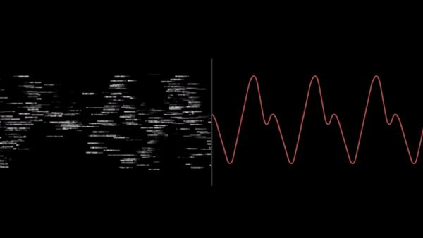
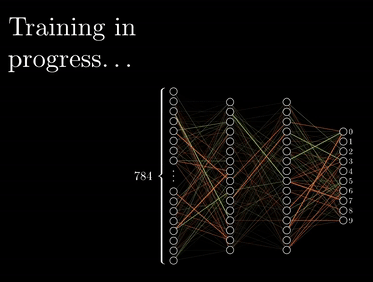
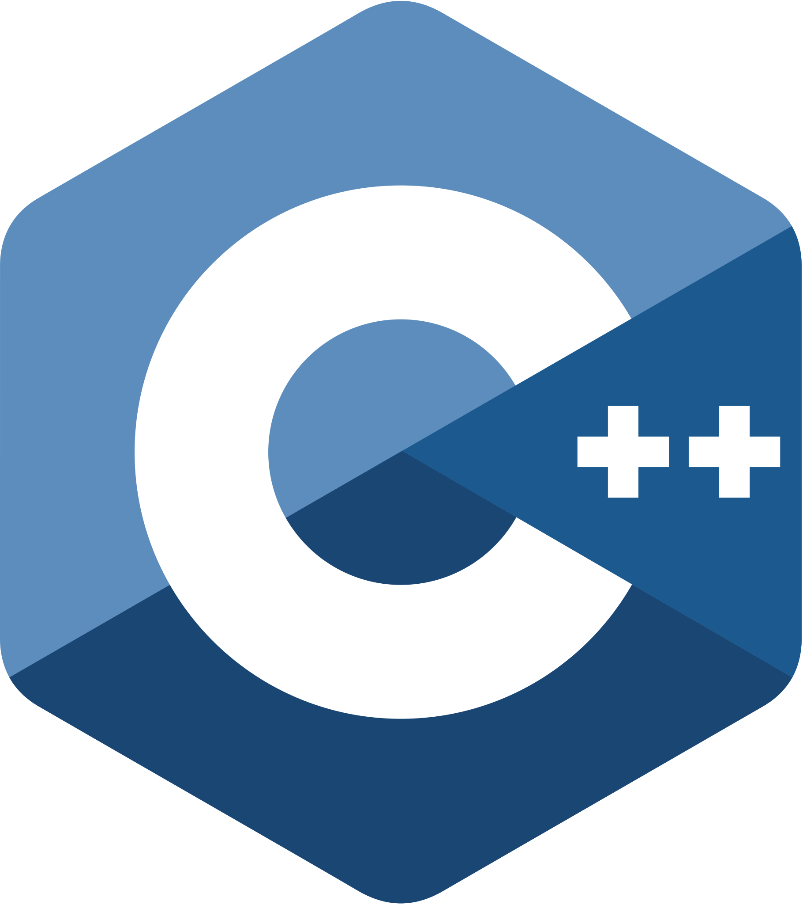

<!--
**tapyu/tapyu** is a ✨ _special_ ✨ repository because its `README.md` (this file) appears on your GitHub profile.

That is what I'm using to make the this Markdown:

*** About wakatime *** (./.github/workflows/waka-readme-stats.yml or the "Waka Readme" github action):
- How To Use Github's New Personal README and Wakatime: https://www.youtube.com/watch?v=jazcHIaitfE
- Adding Weekly Coding Stats to your GitHub Readme Profile: https://www.youtube.com/watch?v=sZi8MmQP3MY

*** About updating README.md with recent activities *** (./.github/workflows/update-readme-recent-activities.yml or the "Update README with recent activities" github action)
- How To Create An Amazing Profile ReadMe With GitHub Actions -> https://www.youtube.com/watch?v=ECuqb5Tv9qI

*** about deploying your own vercel instance (it is the "GitHub Performance" section of my README.dm) ***
1 -> https://github.com/anuraghazra/github-readme-stats#deploy-on-your-own-vercel-instance
2 -> https://www.youtube.com/watch?v=n6d4KHSKqGk&t=107s
3 -> https://github.com/tapyu/github-readme-stats/blob/master/vercel.json
4 -> https://vercel.com/docs/cli#project-configuration
5 -> https://github.com/abhisheknaiidu/awesome-github-profile-readme

*** other things ***
- awesome-github-profile-readme: https://github.com/abhisheknaiidu/awesome-github-profile-readme
- Shelds.io: https://github.com/badges/shields

-->

<p align='center'>
    
</p>

<h1 align="center"><a href="https://linktr.ee/tapyu"><code>>whoami</code></a></h1>
Hi there! I'm Rubem Pacelli (tapyu is just my nickname). I am really into <b>scientific programing languages</b>.
<h1 align="center">Background</h1>
B.Sc. in Electronics Engineering from <a href="https://unifor.br/">Unifor</a>, M.Sc. and PhD in Teleinformatics Engineering from <a href="http://www.ufc.br/">UFC</a>, and PhD in Cotutelle from <a href="https://gage.upc.edu/en">UPC</a>.
<h1 align="center">Research area</h1>
I work in the area of <b>GNSS signal processing</b>, and I especially focus on the following topics:
<table>
  <tr>
    <td width="250">Statistical signal processing, system identification, and adaptive filtering</td>
     <td width="250">Deep learning, pattern recognition, and optimization theory.</td>
     <td width="350">FPGA-based software-defined radio implementation of digital modems</td>
  </tr>
  <tr>
    <td valign="top" align="center"></td>
    <td valign="middle" align="center"></td>
    <td valign="top" align="center"></td>
  </tr>
</table>

<code><a href="https://www.python.org/"></a></code>
<code><a href="https://julialang.org/"></a></code>
<code><a href="https://www.r-project.org/"></a></code>
<code><a href="https://www.mathworks.com/products/matlab.html"></a></code>
<code><a href="https://en.wikipedia.org/wiki/Shell_script"></a></code>
<code><a href="https://en.wikipedia.org/wiki/VHDL"></a></code>
<code><a href="https://en.wikipedia.org/wiki/C_(programming_language)"></a></code>
<code><a href="https://en.wikipedia.org/wiki/C%2B%2B"></a></code>
<br>
<br>
<code><a href="https://code.visualstudio.com/"></a></code>
<code><a href="https://www.linux.org/"></a></code>
<code><a href="https://www.latex-project.org/"></a></code>
<code><a href="https://en.wikipedia.org/wiki/Assembly_language"></a></code>
<code><a href="https://docs.helix-editor.com/"></a></code>
<code><a href="https://git-scm.com/"></a></code>
<code><a href="https://github.com/gnuradio/gnuradio/tree/main"></a></code>
<code><a href="https://github.com/gnss-sdr/gnss-sdr"></a></code>
<br>

---

<h3 align="center">Life is not so serious.</h3>


<details>
    <summary><b>Some nice stats</b></summary>
    <ul> 
    <h3>GitHub Performance</h3>
    <table>
        <tr>
            <td>  </td>
            <td>  </td>
        </tr>
    </table>

### Wakatime stats
<!--START_SECTION:waka-->


**I'm an Early 🐤** 

```text
🌞 Morning                1194 commits        ████░░░░░░░░░░░░░░░░░░░░░   14.72 % 
🌆 Daytime                3063 commits        █████████░░░░░░░░░░░░░░░░   37.76 % 
🌃 Evening                2593 commits        ████████░░░░░░░░░░░░░░░░░   31.97 % 
🌙 Night                  1261 commits        ████░░░░░░░░░░░░░░░░░░░░░   15.55 % 
```
📅 **I'm Most Productive on Tuesday** 

```text
Monday                   1371 commits        ████░░░░░░░░░░░░░░░░░░░░░   16.90 % 
Tuesday                  1412 commits        ████░░░░░░░░░░░░░░░░░░░░░   17.41 % 
Wednesday                1378 commits        ████░░░░░░░░░░░░░░░░░░░░░   16.99 % 
Thursday                 1391 commits        ████░░░░░░░░░░░░░░░░░░░░░   17.15 % 
Friday                   1129 commits        ███░░░░░░░░░░░░░░░░░░░░░░   13.92 % 
Saturday                 751 commits         ██░░░░░░░░░░░░░░░░░░░░░░░   09.26 % 
Sunday                   679 commits         ██░░░░░░░░░░░░░░░░░░░░░░░   08.37 % 
```


📊 **This Week I Spent My Time On** 

```text
💬 Programming Languages: 
C                        33 hrs 15 mins      ████████████████████████░   96.34 % 
Makefile                 38 mins             ░░░░░░░░░░░░░░░░░░░░░░░░░   01.84 % 
Other                    23 mins             ░░░░░░░░░░░░░░░░░░░░░░░░░   01.16 % 
Markdown                 6 mins              ░░░░░░░░░░░░░░░░░░░░░░░░░   00.31 % 
JSON                     5 mins              ░░░░░░░░░░░░░░░░░░░░░░░░░   00.27 % 

🔥 Editors: 
VS Code                  30 hrs              ██████████████████████░░░   86.93 % 
Claude Code              4 hrs 30 mins       ███░░░░░░░░░░░░░░░░░░░░░░   13.07 % 

🐱‍💻 Projects: 
gnss-sdr-sim             32 hrs 29 mins      ████████████████████████░   94.12 % 
multi-sdr-gps-sim        1 hr 49 mins        █░░░░░░░░░░░░░░░░░░░░░░░░   05.30 % 
tapyu                    12 mins             ░░░░░░░░░░░░░░░░░░░░░░░░░   00.58 % 

💻 Operating System: 
Linux                    34 hrs 30 mins      █████████████████████████   100.00 % 
```

🤖 **AI Coding This Week** 

```text
⏱ AI Coding Time: 13 hrs 58 mins (40.49%)

✍️ 1,683 lines written by AI, 2,149 lines written by hand (43.92% AI-written)

🔤 8,251,591 Input Tokens, 242,536 Output Tokens

💵 $47.02 Estimated AI Cost This Week

🧠 12 AI Sessions, 730 AI Prompts

Sonnet                   2,143 lines         █████████████████████████   99.40 % 
Github-Copilot           13 lines            ░░░░░░░░░░░░░░░░░░░░░░░░░   00.60 % 

🔎 AI Coding Insights:
⚖️ Balanced with AI — 43.92% of written lines came from AI
📝 Concise Prompter — average 170 characters per prompt
🔁 Iterative Prompter — average 61 prompts per session
🔍 Hands-On Reviewer — 65.05% of changed lines were hand-edited
```


 Last Updated on 25/09/2026 21:54:16 UTC
<!--END_SECTION:waka-->

### Recent GitHub Activity
<!--START_SECTION:activity-->
1. ❗ Opened issue [#18](https://github.com/harshadms/galileo-sdr-sim/issues/18) in [harshadms/galileo-sdr-sim](https://github.com/harshadms/galileo-sdr-sim)
2. 🗣 Commented on [#472](https://github.com/TorchDSP/torchsig/issues/472#issuecomment-5776354123) in [TorchDSP/torchsig](https://github.com/TorchDSP/torchsig)
3. 🔒 Closed issue [#472](https://github.com/TorchDSP/torchsig/issues/472) in [TorchDSP/torchsig](https://github.com/TorchDSP/torchsig)
4. 🗣 Commented on [#471](https://github.com/TorchDSP/torchsig/issues/471#issuecomment-5776332592) in [TorchDSP/torchsig](https://github.com/TorchDSP/torchsig)
5. 🔒 Closed issue [#471](https://github.com/TorchDSP/torchsig/issues/471) in [TorchDSP/torchsig](https://github.com/TorchDSP/torchsig)
<!--END_SECTION:activity-->

### Latest Youtube Video 📺
<!-- YOUTUBE:START -->
- [Mr. Robot - Darlene hacks parking gate with HackRF](https://www.youtube.com/watch?v=y8VQRXDm4hQ)
<!-- YOUTUBE:END -->
</ul>
</details>
